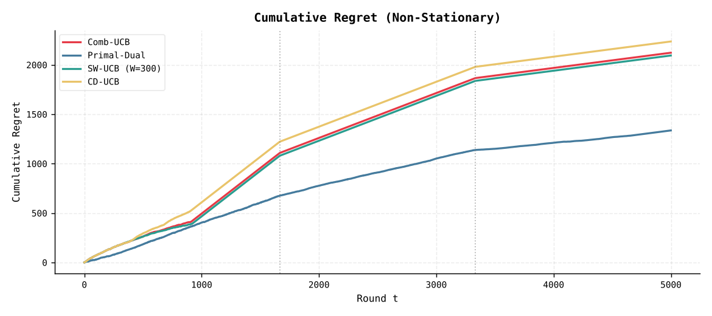
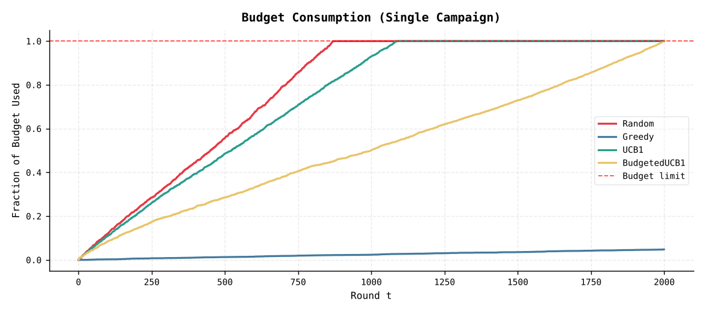
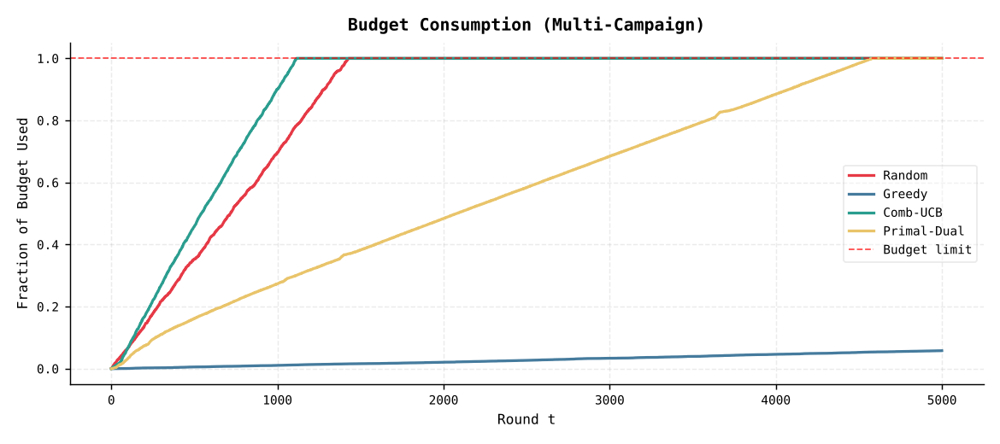

<div align="center">

# Budget-Constrained Bidding with Multi-Armed Bandits

Online learning algorithms that learn how much to bid in first-price ad auctions,<br>under a global budget, conflicts between campaigns and a market that changes over time.




</div>

<br>

| | |
|---|---|
| Context | Course project, *Online Learning* |
| What | 8 bandit policies implemented from scratch, 3 simulated environments |
| Key finding | Budget pacing (primal-dual) earns 2 to 5 times more than budget-agnostic UCB variants |
| Reproducibility | Every experiment is seeded: two runs give identical results |

---

## Contents

- [Problem](#problem)
- [Algorithms](#algorithms)
- [Experiments](#experiments)
- [Results](#results)
- [Getting started](#getting-started)
- [Project structure](#project-structure)
- [Limitations](#limitations)

---

## Problem

An advertiser runs N campaigns. At each round `t = 1, …, T`:

1. the agent picks a bid `bᵢ` from a discrete grid for each campaign it plays;
2. a competing bid `mᵢ,ₜ` is drawn from a distribution the agent does not know;
3. first-price auction: campaign `i` wins if `bᵢ ≥ mᵢ,ₜ` and then pays its own bid;
4. a win yields utility `vᵢ − bᵢ` and costs `bᵢ`; a loss yields and costs nothing.

Two constraints make it hard:

- a global budget `B`, shared by all campaigns over the whole horizon;
- a conflict graph: two incompatible campaigns (for example competing brands) cannot be played in the same round.

The goal is to maximise cumulative utility within the budget. Regret is measured against the best fixed bid or campaign set per round (the oracle). This oracle ignores the budget, so it is an optimistic benchmark: no policy can actually reach it within B.

## Algorithms

| Policy | Setting | Idea |
|---|---|---|
| Random | all | Uniform random bids, used as a baseline |
| Greedy | all | Always plays the best empirical mean, no exploration |
| UCB1 | single campaign | Optimism in the face of uncertainty: `μ̂ + √(2 log t / n)`, ignores the budget |
| Budgeted UCB1 | single campaign | UCB1 with a pacing penalty when the remaining budget runs low |
| Combinatorial UCB | multi-campaign | One UCB index per (campaign, bid) arm, combined by an oracle over feasible campaign sets (independent sets of the conflict graph) |
| Primal-dual pacing | multi-campaign | A Lagrange multiplier `λ` prices the budget and is updated every round by an online gradient step (`η = 1/√T`) |
| Sliding-window UCB | non-stationary | UCB computed on the last `W = 300` observations only |
| Change-detection UCB | non-stationary | A CUSUM detector resets an arm's statistics when its distribution shifts |

## Experiments

| | Exp. 1: single campaign | Exp. 2: multi-campaign | Exp. 3: non-stationary |
|---|---|---|---|
| Horizon `T` | 2,000 | 5,000 | 5,000 |
| Budget `B` | 400 | 1,000 | 1,000 |
| Campaign values | 0.8 | 0.9, 0.75, 0.6, 0.8, 0.7 | same as Exp. 2 |
| Conflicts | none | (0,1), (2,3) | (0,1), (2,3) |
| Competing bids | Beta(2,5) | Beta(2,5), Beta(5,2), Uniform, Beta(3,3), Beta(2,2) | 3 phases: Beta(2,5) → Beta(3,3) → Beta(5,2) |
| Bid grid | {0.0, 0.1, …, 1.0} | same | same |

Metrics: cumulative reward, cumulative pseudo-regret against the oracle, budget consumption over time and win rate.

## Results

All numbers come from `python main.py` and match the tables saved in [`results/`](results/).

<table>
<tr>
<td valign="top">

Exp. 1: single campaign<br>
<sub>oracle: bid 0.40, 0.307 reward/round</sub>

| Policy | Reward | Win rate | Budget |
|---|---:|---:|---:|
| Random | 76.8 | 0.298 | 100 % |
| Greedy | 134.4 | 0.096 | 5 % |
| UCB1 | 228.0 | 0.393 | 100 % |
| Budgeted UCB1 | 476.8 | 0.548 | 100 % |

</td>
<td valign="top">

Exp. 2: five campaigns<br>
<sub>oracle: campaigns {0, 3, 4}, 0.639 reward/round</sub>

| Policy | Reward | Win rate | Budget |
|---|---:|---:|---:|
| Random | 46.5 | 0.203 | 100 % |
| Greedy | 464.0 | 0.116 | 6 % |
| Combinatorial UCB | 303.7 | 0.194 | 100 % |
| Primal-dual | 1,482.8 | 0.482 | 100 % |

</td>
<td valign="top">

Exp. 3: non-stationary<br>
<sub>oracle: 0.922 → 0.455 → 0.154 reward/round</sub>

| Policy | Reward | Win rate | Budget |
|---|---:|---:|---:|
| Combinatorial UCB | 427.8 | 0.176 | 100 % |
| Primal-dual | 1,214.3 | 0.442 | 100 % |
| Sliding-window UCB | 456.0 | 0.177 | 100 % |
| Change-detection UCB | 313.9 | 0.169 | 100 % |

</td>
</tr>
</table>

<p align="center">
  
  
</p>

### Takeaways

1. Pacing decides the outcome. The budget-aware policies (Budgeted UCB1, primal-dual) collect two to five times more reward. Policies that ignore the budget exhaust it between rounds 900 and 1,100 and cannot bid afterwards, so their regret grows linearly from then on.
2. Greedy under-explores. It locks onto low bids early, spends about 5 % of the budget and leaves most of the value unused.
3. In a changing market, pacing still beats adaptation. Sliding-window and change-detection UCB spend the whole budget during the first phase, so detecting later shifts no longer helps them. Primal-dual has the lowest regret in every phase.

## Getting started

```bash
git clone https://github.com/bilal-jaiel/online-learning-application.git
cd online-learning-application
pip install -r requirements.txt

python main.py           # the three experiments
python main.py --exp 1   # single campaign
python main.py --exp 2   # multi-campaign, stochastic
python main.py --exp 3   # multi-campaign, non-stationary
```

Figures and comparison tables are written to `results/`. A full run takes a few minutes on a laptop.

## Project structure

```
├── main.py                       entry point, runs one or all experiments
├── environments/
│   ├── single_campaign_env.py    one campaign, stochastic competing bids
│   ├── multi_campaign_env.py     N campaigns and a conflict graph
│   └── non_stationary_env.py     piecewise-stationary competition
├── algorithms/                   the eight policies
├── experiments/
│   ├── exp_single_campaign.py    Experiment 1
│   ├── exp_multi_campaign.py     Experiment 2
│   └── exp_non_stationary.py     Experiment 3
├── utils/
│   ├── oracle.py                 best feasible campaign set and bid
│   ├── metrics.py                reward, regret, budget consumption
│   └── plots.py                  figures and comparison tables
└── results/                      generated figures
```

## Limitations

- One simulation per configuration. Averaging over several seeds, with confidence intervals, would make the comparison more robust.
- The multi-campaign policies can overshoot the budget by a fraction of a unit (spend of up to 1,000.3 for B = 1,000), because the last round's bids are not clipped to the remaining budget.
- The non-stationary policies do not pace their spending. Combining a sliding window or change detection with primal-dual pacing is the natural next step.
- Bids live on a grid of 11 values; continuous bidding would need a different family of algorithms.

---

<div align="center">
<sub>Bilâl Jaiel · <a href="https://github.com/bilal-jaiel">GitHub</a> · <a href="https://www.linkedin.com/in/bilal-jaiel/">LinkedIn</a></sub>
</div>
